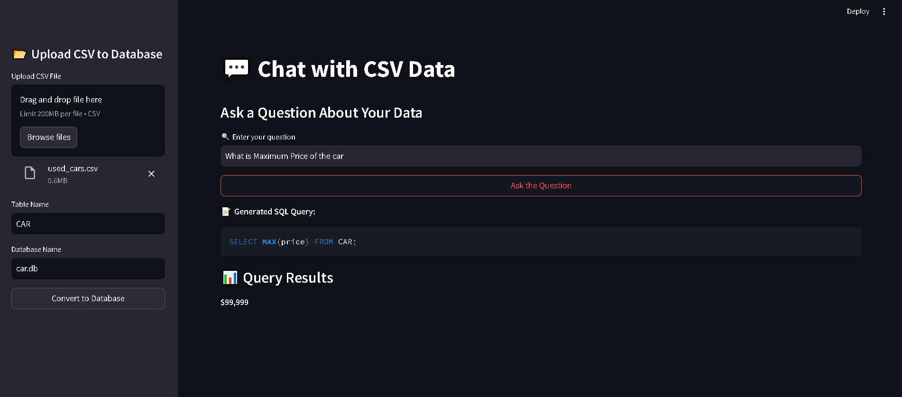

# Chat with CSV



## 📌 Overview
"Chat with CSV" is a Streamlit-based application that allows users to upload a CSV file, convert it into a SQLite database, and interact with the data using natural language queries. The application leverages Google's Gemini AI model to generate SQL queries based on user input and executes them on the uploaded database.

## 🚀 Features
- 📂 **Upload a CSV file** and convert it into a SQLite database dynamically.
- 🛠 **AI-powered SQL query generation** using the Gemini model.
- 🔍 **Ask questions in natural language**, and the AI will generate an SQL query.
- 📊 **Retrieve and display query results** in an interactive UI.
- 🎨 **Streamlit-based interface** for a seamless user experience.

## 🛠️ Installation
### Prerequisites
Ensure you have Python installed along with the required dependencies.

### Clone the Repository
```bash
git clone https://github.com/PriyanshuDey23/CSV-DB-ChatPro.git
cd chat-with-csv
```

### Install Dependencies
```bash
pip install -r requirements.txt
```

### Environment Variables
Create a `.env` file and add the following line with your Google API Key:
```env
GOOGLE_API_KEY=your_google_api_key
```

## ▶️ Usage
Run the application using the command:
```bash
streamlit run app.py
```

## 📌 How It Works
1. **Upload CSV File**: Navigate to the sidebar and upload your CSV file.
2. **Enter Table & Database Name**: Provide a table name and database name.
3. **Convert CSV to Database**: Click the "Convert to Database" button.
4. **Ask Questions**: Enter your question in natural language.
5. **View AI-Generated SQL Query**: The AI generates an SQL query based on your question.
6. **Retrieve Results**: The query runs on the database and returns results.

## 🏗️ Project Structure
```
├── app.py                 # Main Streamlit app
├── prompt.py              # AI prompt template
├── requirements.txt       # Required Python libraries
├── .env                   # Environment variables
└── README.md              # Project documentation
```

## 📦 Dependencies
- `streamlit`
- `pandas`
- `sqlite3`
- `python-dotenv`
- `google-generativeai`


## 📜 License
This project is licensed under the [MIT License](LICENSE).

